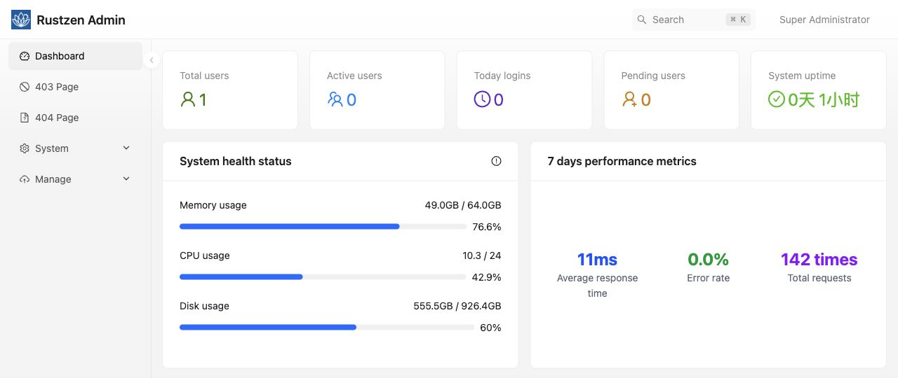
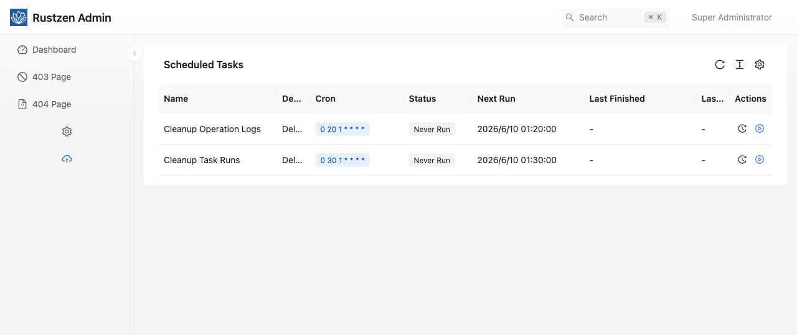
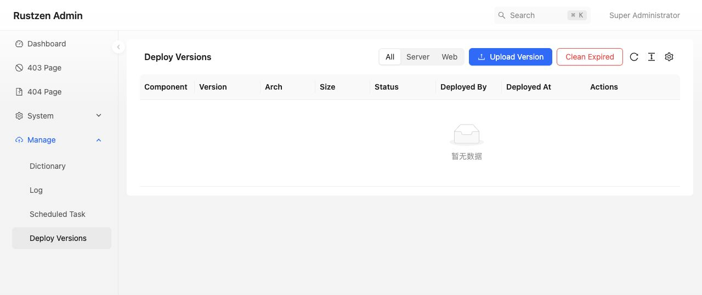
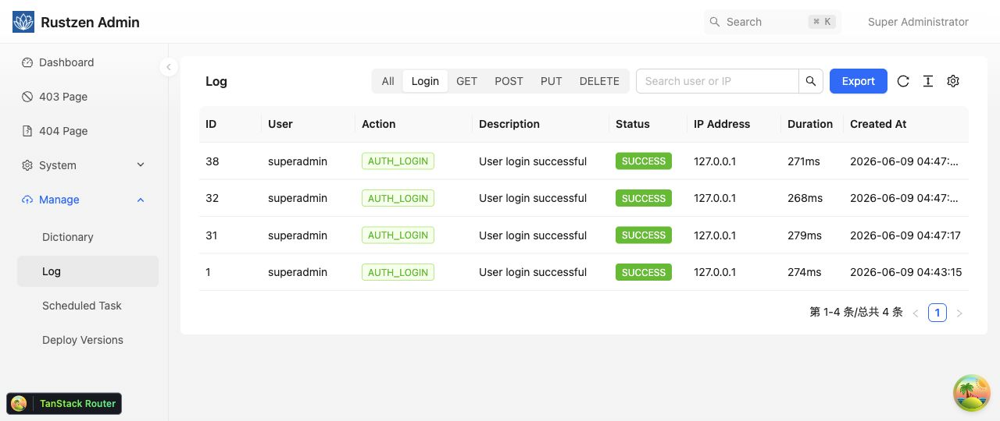

# rustzen-admin

`rustzen-admin` provides the RustZen Admin, Monitor, Insights, and Reports
runtime in one source repository and one complete `rz` release artifact.

A structured monorepo starting point for Rust full-stack admin systems.

> `rustzen-admin` combines an Axum backend, a React frontend, shared crates,
> deployment assets, and repository-level documentation in a single codebase
> designed for clear boundaries, maintainability, and AI-friendly collaboration.

## Overview

`rustzen-admin` is an open-source full-stack admin template built for real-world
projects, not just isolated UI demos.

The repository is organized as a monorepo:

- `crates/auth/` contains shared auth and permission capabilities for Rust services
- `crates/storage/` contains the admin SQLite adapter and migration entrypoints
- `apps/server/` contains the Admin API plus isolated Monitor, Insights, and Reports process modes
- `apps/web/` contains the React frontend application
- `deploy/` contains deployment assets and release support files
- `docs/` contains repository-level architecture and development guides
- the root keeps shared commands, workspace metadata, and collaboration entry documents

This layout keeps backend, frontend, and repository rules explicit, making the codebase easier to understand, review, and evolve.

## Screenshots

| Dashboard | Scheduled Tasks |
| --- | --- |
|  |  |

| Deploy Versions | Operation Logs |
| --- | --- |
|  |  |

## Repository Layout

→ Architecture summary: [docs/architecture.md](./docs/architecture.md)

## Documentation

→ Complete documentation index: [docs/README.md](./docs/README.md)

## Command Source

Use the root `justfile` as the command source of truth; inspect the relevant target before running it.

```bash
cp .env.example .env
cargo run -p server -- admin serve
```

Local startup is SQLite-first and does not require PostgreSQL.
SQLite connection primitives, role policy, runtime layout, and logging are owned
inside this repository; there is no `rustzen-core` runtime dependency.
Set `RUSTZEN_JWT_SECRET` in `.env` before starting the backend.

If startup fails with `VersionMismatch`, your local database schema is out-of-date with current migration checksums. Run:

```bash
cp .env.example .env
just reset-db
cargo run -p server -- admin serve
```

If startup succeeds, the database will be recreated automatically.

## Demo

- Local demo URL: [https://admin.rustzen.dev](https://admin.rustzen.dev)
- Demo username: `superadmin`
- Demo password: `rustzen@123`

## Notes

- `README.md` and `AGENTS.md` stay as lightweight entry documents.
- `docs/history/` contains historical execution records and is not current implementation truth.

## License and Trademark

Source code is licensed under the [Apache License 2.0](./LICENSE.md). Commercial
use, modification, and distribution are permitted subject to that license.
Rustzen names, logos, domains, official package namespaces, and official
distribution channels are not included in the software license. See
[NOTICE.md](./NOTICE.md) and [TRADEMARKS.md](./TRADEMARKS.md).
