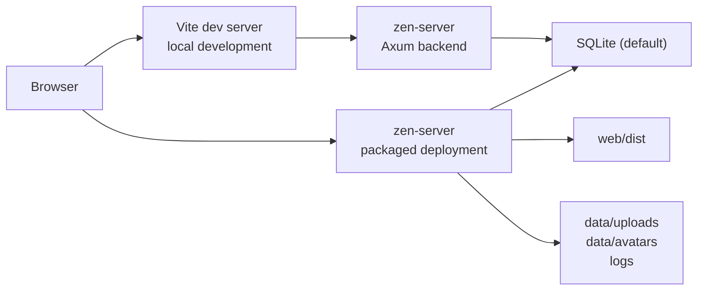
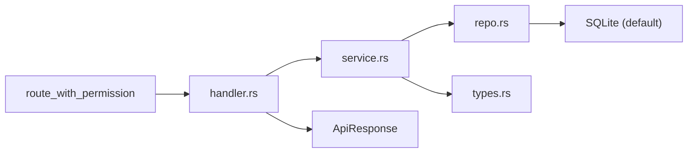
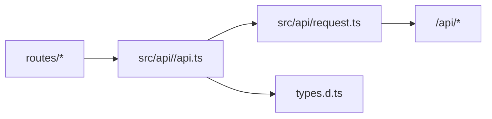
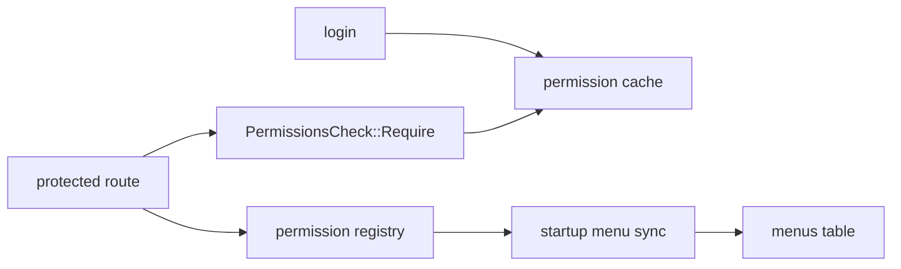

# Architecture Diagrams

These diagrams explain the current architecture. Source code and `docs/architecture.md` take precedence when details drift.

## Runtime Topology

## Backend Request Flow

## Frontend API Flow

## Permission Flow

