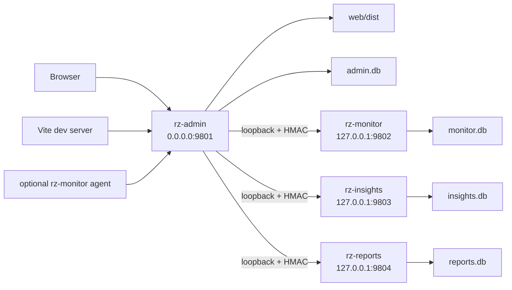
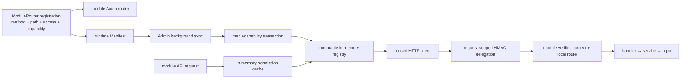
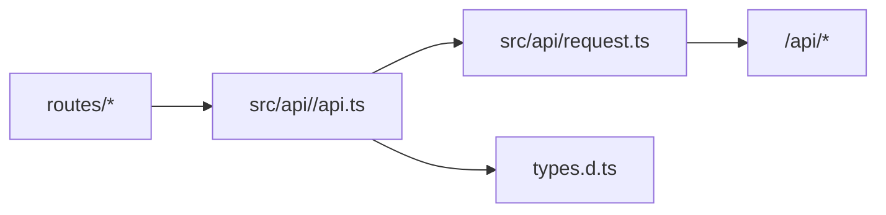
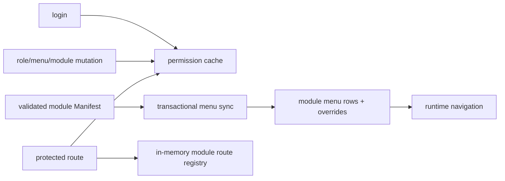

# Architecture Diagrams

These diagrams explain the current architecture. Source code and `docs/architecture.md` take precedence when details drift.

## Runtime Topology

All four server processes are members of one `rz.target` and one signed release
bundle, but each has its own restart and database boundary.

## Module Contract And Gateway Flow

## Frontend API Flow

## Permission Flow

